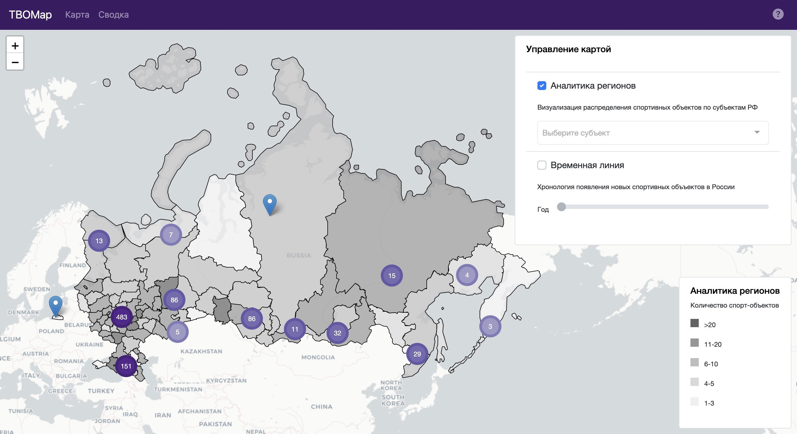

## [TBOMap](https://tbo.gmrybkin.com) - проект полуфинала олимпиады "Траектория Будущего" Fullstack-разработка

#### Что это за сервис?
Перед вами – карта, которая объединяет в себе данные по всем спортивным объектам в России. Узнайте, как год за годом 
изменялась спортивная инфраструктура страны, какие субъекты РФ могут похвастаться самым лучшим спортивным оснащением, и множество других не менее интересных фактов. Вперед!



### Проект
Проект доступен по ссылке https://tbo.gmrybkin.com

#### Возможности
##### Аналитика объектов
Каждый объект – точка на карте. При уменьшении масштаба объекты объединяются в группы по местоположению. При нажатии на объект можно получить подробный отчет о нем: общую информацию, детализацию финансирования и контакты.

##### Аналитика регионов
На интерактивной карте вы можете изучить распределение спортивных объектов по регионам. Чем темнее регион – тем больше объектов, чем светлее – тем меньше. При помощи фильтра можно оставить только интересующие вас субъекты РФ, чтобы работать с ними.

##### Временная линия
Двигайте ползунок, чтобы увидеть, где с течением времени строились новые спортивные объекты. Цвет полигонов зависит от типа построенных спортивных объектов.

##### Итоговая сводка
В отдельной вкладке собраны графики и диаграммы, которые позволяют детально изучить информацию о спортивных объектах: в динамике и в обобщенном виде.

#### Стек технологий
Backend:
- Flask
- SQLAlchemy
- PostgreSQL
- Postgis

Frontend:
- Vue.js
- Leaflet
- Bootstrap

#### Дополнительные инструменты
Для отображения слоя с федеральными субъектами были выгружены полигоны с OpenStreetMap.  
Более подробно можно почитать в файле `TBO.ipynb`

#### Сборка backend
Перейти в директорию `backend` и выполнить:
```
docker-compose up --build -d
```

#### Сборка frontend
Перейти в директорию `frontend` и выполнить:
```
npm install
npm run build
```

#### Авторство
[Георгий Рыбкин](https://gmrybkin.com), 2023